# Set up for end-to-end demo

## Configure O365

- [Enable guest access for Teams](https://docs.microsoft.com/en-us/microsoftteams/set-up-guests)

## Create SharePoint site

1. Go to your Office 365 organization's root SharePoint site.
1. Choose **Create Site**, then choose **Team site**. Name the site `Flight Admin` and choose **Next**, then choose **Finish**.
1. When the new site loads in the browser, locate the **Documents** web part. Using either the **New** or the **Upload** button in that web part, add a Word document called `Flight Log.docx`.
1. On the site's home page, choose **New** in the upper-left corner, then choose **List**. Name the list `Master Flight List` and choose **Create**.
1. When the new list loads in the browser, use the **Add column** button to add the following columns:

    | Name | Type | Require a value? | Other settings |
    |------|------|------------------|------------------------|
    | Flight Number | Number | Yes | **Number of decimal places:** 0, **Enforce unique values:** Yes |
    | Admin | Person | Yes | **Allow selection of groups:** No, **Allow multiple selections:** No |
    | Pilots | Person | Yes | **Allow selection of groups:** No, **Allow multiple selections:** Yes |
    | Flight Attendants | Person | Yes | **Allow selection of groups:** No, **Allow multiple selections:** Yes |
    | Catering Liaison | Single line of text | Yes | |
    | Departure Gate | Single line of text | Yes | |
    | Departure Time | Date | Yes | **Include time:** Yes |

When you're done, the list should look something like this.

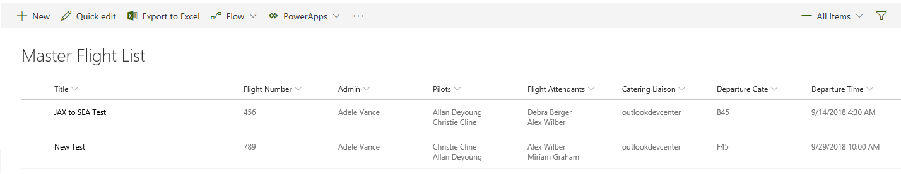

## Provision Azure Resources

### Create a new Function App

1. Go to the [Azure Portal](https://portal.azure.com). Use the **Create a resource** button to add a new **Function App**. Be sure to select **.NET** for the **Runtime Stack**.
1. Once the app is created, navigate to it in the Azure Portal.
1. On the **Overview** tab select **Get publish profile**. Save the downloaded file, you'll need it later.
1. Copy the **URL** value, you'll need it later.

### Create app registrations

You need to create two app registration in the Azure Portal.

1. Choose **Azure Active Directory** in the left-hand navigation in the Azure Portal.
1. Under **Manage**, choose **App registrations (Preview)**.

### Register app for Azure Function

1. Choose **New registration**.
1. Set the **Name** to `Flight Team Provisioning Function`.
1. Set the **Supported account types** to **Accounts in this organizational directory only**.
1. Under **Redirect URI**, set the drop-down to **Web**, and set the value to the URL for the Azure Functions app.
1. Choose **Register**.
1. Copy the value of **Application (client) ID**, you will need it later.
1. Choose **API permissions**, then choose **Add a permission**.
1. Choose **Microsoft Graph**, then choose **Delegated permissions**.
1. Select the following under **Delegated permissions**:
    - **Files.ReadWrite.All**
    - **Group.ReadWrite.All**
    - **Notifications.ReadWrite.CreatedByApp**
    - **Sites.Manage.All**
    - **Sites.ReadWrite.All**
    - **User.Invite.All**
    - **User.Read**
    - **User.Read.All**
1. Choose **Add permissions**.
1. Under **Grant consent**, select **Grant admin consent for...** to consent to the app.
1. Choose **Certificates & secrets** under **Manage**, then choose **New client secret**.
1. Enter a description, select a duration, then choose **Add**. Copy the **Value**, you will need it later.
1. Choose **Expose an API** under **Manage**, then choose **Add a scope**.
1. Leave the value for **Application ID URI** set to the generated value and choose **Save and continue**.
1. Set the **Scope name** to `provision.teams`.
1. Set **Who can consent?** to **Admins only**.
1. Set **Admin consent display name** to `Access Flight Team Provisioning`.
1. Set **Admin consent description** to `Have full access to the flight team provisioning APIs`.
1. Choose **Add scope**.

### Register app for Microsoft Flow

1. Choose **New registration**.
1. Set the **Name** to `Flight Team Provisioning Connector`.
1. Set the **Supported account types** to **Accounts in this organizational directory only**.
1. Under **Redirect URI**, leave the value empty.
1. Choose **Register**.
1. Copy the values of **Application ID** and **Tenant ID**, you will need them later.
1. Choose **API permissions**, then choose **Add a permission**.
1. Select the **My APIs** tab, then select **Flight Team Provisioning Function**.
1. Select the **provision.teams** permission and choose **Add permissions**.
1. Choose **Certificates & secrets** under **Manage**, then choose **New client secret**.
1. Enter a description, select a duration, then choose **Add**. Copy the **Value**, you will need it later.

### Update the app registration for the Azure Function

1. Navigate to the `Flight Team Provisioning Function` app registration, then select **Expose an API** under **Manage**.
1. Select **Add a client application**.
1. Set **Client ID** to the application ID of the `Flight Team Provisioning Connector` app registration.
1. Select the `provision.teams` scope under **Authorized scopes**.
1. Chose **Add application**.

### Configure .NET project

1. Rename the `local.settings.json.example` file to `local.settings.json`, then open the file.
1. Replace `YOUR TENANT ID HERE` with your tenant ID.
1. Replace `YOUR TENANT NAME HERE` with your tenant's domain name.
1. Replace `YOUR APP ID HERE` with the application ID for the `Flight Team Provisioning Function` app registration.
1. Replace `YOUR APP SECRET HERE` with the client secret for the `Flight Team Provisioning Function` app registration.

### Create schema extension

This sample uses a [schema extension](https://developer.microsoft.com/en-us/graph/docs/api-reference/beta/resources/schemaextension) to save the item ID of the SharePoint list item that initiated the team provisioning onto the group in Microsoft Graph. This is used to find the group later when archiving the team or notifying members of a change to the departure gate.

1. Go to [Graph Explorer](https://developer.microsoft.com/en-us/graph/graph-explorer) and login with an administrator account.
1. Select the **modify permissions** link and select the **Directory.AccessAsUser.All** permission. Select **Modify Permissions**.

    > **Note**: If the **Directory.AccessAsUser.All** permissions is disabled and displays **Consented**, you've already enabled this permission.
1. Change the method to **POST**, the version to **beta**, and set the URL to `https://graph.microsoft.com/beta/schemaExtensions`.

    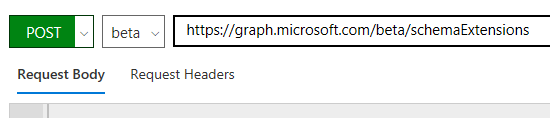

1. In the **Request Body**, add the following JSON, replacing `app-id-for-flight-team-provisioning-function` with the application ID for your `Flight Team Provisioning Function` app registration.

    ```json
    {
        "id":"contosoFlightTeam",
        "owner": "app-id-for-flight-team-provisioning-function",
        "description": "Contoso Flight Team Provisioning extensions",
        "targetTypes": [
            "Group"
        ],
        "properties": [
            {
                "name": "sharePointItemId",
                "type": "Integer"
            }
        ]
    }
    ```

1. Choose **Run Query**.
1. In the **Response Preview**, locate the value of the `id` property. Copy this value.
1. Open the `./create-flight-team/Graph/GraphResources.cs` file and replace `YOUR_SCHEMA_EXTENSION_NAME` with the value you just copied.

## Configure Microsoft Flow

### Add custom connector for Azure functions

1. Rename the **postman_collection.json.example** to **postman_collection.json**, then open it in a text editor.
1. Replace all instances of `https://<your-azure-function-url>` with the URL to your Function App. Save your changes.
1. Go to [Microsoft Flow](https://flow.microsoft.com). Select the "gear" icon in the top right, then choose **Custom Connectors**.
1. Choose **Create custom connector**, then choose **Import a Postman collection**.
1. Enter `Contoso Team Provisioning` for **Custom connector name**, then browse for **postman_collection.json** in the **Upload a postman collection (V1)** field. Choose **Continue**.
1. Under **General information**, verify that the **Host** field matches the URL of your Functions App, and the **Base URL** is set to `/`. Choose **Security**.
1. Change **Authentication type** to **OAuth 2.0**, then fill in the fields as follows:
    1. Change **Identity Provider** to **Azure Active Directory**.
    1. Enter the application ID for the `Flight Team Provisioning Connector` app registration in the **Client id** field.
    1. Enter the application password for the `Flight Team Provisioning Connector` app registration in the **Client secret** field.
    1. Enter your tenant ID in the **Tenant ID** field.
    1. Enter the application ID for the `Flight Team Provisioning Function` in the **Resource URL** field.
    1. Leave all other fields as their default values.
1. Select **Create connector**. Copy the value of the **Redirect URL**, you will need it later.

### Update app registration for Microsoft Flow

1. In the Azure Portal, navigate to the `Flight Team Provisioning Connector` app registration.
1. Select **Authentication** under **Manage**.
1. Under **Redirect URIs**, change the **TYPE** to **Web** and add the value of **Redirect URL** you copied when creating the custom Flow connector in the **REDIRECT URI**, then choose **Save**.

### Create the "Create Team" flow

1. Go to [Microsoft Flow](https://flow.microsoft.com). Choose **My flows**.
1. Choose **New**, then **Create from blank**.
1. On the next page, choose **Create from blank**.
1. Enter `SharePoint` in the search box, then select **SharePoint - When an item is created**.
    1. Enter the URL to your **Flight Admin** site you created earlier for **Site Address**, then select **Master Flight List** for **List Name**.

    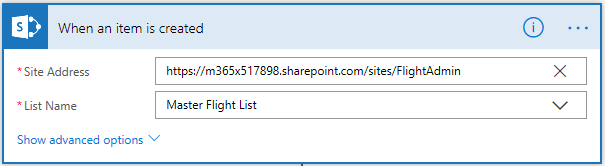

1. Choose **New Step**.
1. Enter `variable` in the search box, then select **Initialize variable**.
    1. Enter `pilotEmails` for **Name**, change **Type** to **Array**, leave **Value** blank.

    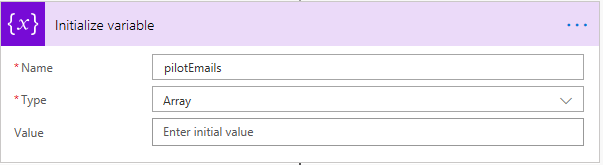

1. Choose **New Step**.
1. Enter `apply` in the search box, then select **Apply to each**.
    1. For **Select an output from previous steps**, under **Dynamic content** select **Pilots**.
    1. Choose **Add an action**
    1. Enter `variable` in the search box, then select **Append to array variable**.
        1. Enter `pilotEmails` for **Name**.
        1. For **Value**, under **Dynamic content** select **Pilots Email**.

    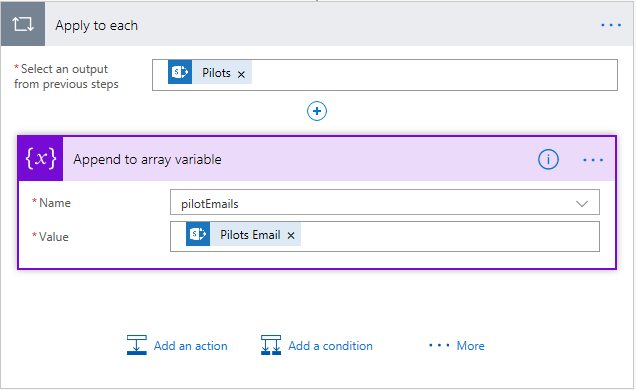

1. Choose **New Step**.
1. Enter `variable` in the search box, then select **Initialize variable**.
    1. Enter `flightAttendantEmails` for **Name**, change **Type** to **Array**, leave **Value** blank.

    

1. Choose **New Step**.
1. Enter `apply` in the search box, then select **Apply to each**.
    1. For **Select an output from previous steps**, under **Dynamic content** select **Flight Attendants**.
    1. Choose **Add an action**
    1. Enter `variable` in the search box, then select **Append to array variable**.
        1. Enter `flightAttendantEmails` for **Name**.
        1. For **Value**, under **Dynamic content** select **Flight Attendants Email**.

    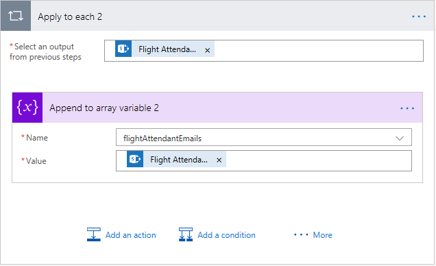

1. Choose **New Step**.
1. Enter `Contoso` in the search box, then select **CreateFlightTeam**.
1. Choose **Sign in**. **Be sure to use an administrator account** when you sign in to create the connection. The permissions required by the sample require administrator consent.
1. Once sign in and consent are complete, you should see a form for the action. Fill in the fields as follows using the Flow UI.
    1. **sharePointItemId**: Under **Dynamic content** choose **See more**, then select **ID**.
    1. **flightNumber**: Under **Dynamic content** choose **See more**, then select **Flight Number**.
    1. **description**: Under **Dynamic content** select **Title**.
    1. **admin**: Under **Dynamic content** select **Admin Email**.
    1. **pilots**: Choose the **Switch to input entire array** toggle to the right of the input box, then place your cursor in the input box. Under **Dynamic content**, select **pilotEmails**.
    1. **flightAttendants**: Choose the **Switch to input entire array** toggle to the right of the input box, then place your cursor in the input box. Under **Dynamic content**, select **flightAttendantEmails**.
    1. **cateringLiaison**: Under **Dynamic content** select **Catering Liaison**.
    1. **departureGate**: Under **Dynamic content** select **Departure Gate**.
    1. **departureTime**: Under **Dynamic content** select **Departure Time**.

    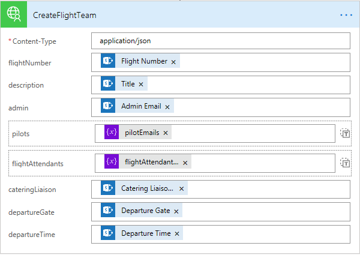

1. Choose **New Step**.
1. Enter `notification` in the search box, then select **Send me an email notification**.
    1. For **Subject**, enter `Microsoft Team created for Flight`, then under **Dynamic content** choose **See more**, then select **Flight Number**.
    1. For **Body**, under **Dynamic content** select **Link to item**.

    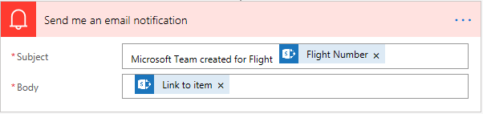

1. Hover over the arrow above the **Send me an email notification** action and choose the **+**, then **Add a parallel branch**, then **Add an action**.
1. Enter `notification` in the search box, then select **Send me an email notification**.
    1. For **Subject**, enter `Error creating Microsoft Team for Flight`, then under **Dynamic content** choose **See more**, then select **Flight Number**.
    1. For **Body**, enter `Details:`, then under **Dynamic content** select **Body**.
    1. Choose the **...** on the action and choose **Configure run after**.
        1. Unselect **is successful**
        1. Select **has failed**
        1. Choose **Done**.

    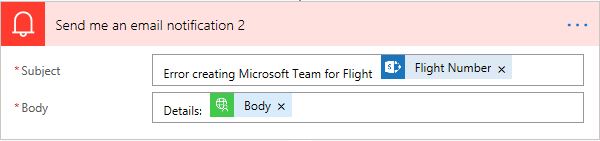

The email notification actions should look like the following when you're done.

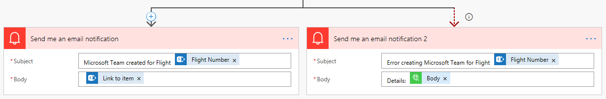

Select **Save** to save the flow.

### Create the "Archive Team" flow

1. Go to [Microsoft Flow](https://flow.microsoft.com). Choose **My flows**.
1. Choose **Create from blank**.
1. On the next page, choose **Create from blank**.
1. Enter `SharePoint` in the search box, then select **SharePoint - When an item is deleted**.
    1. Enter the URL to your **Flight Admin** site you created earlier for **Site Address**, then select **Master Flight List** for **List Name**.

    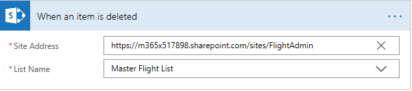

1. Choose **New Step**, then **Add an action**.
1. Enter `Contoso` in the search box, then select **Contoso Team Provisioning - ArchiveFlightTeam**.
1. Fill in the fields as follows using the Flow UI.
    1. **sharePointItemId**: Under **Dynamic content** choose **See more**, then select **ID**.

    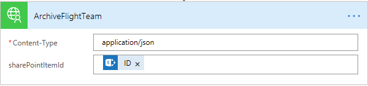

Select **Save** to save the flow.

### Create the "Notify Team" flow

For this flow, we will start with an existing template and modify it to our use. Unfortunately the Flow team removed the "When an existing item is modified" trigger for SharePoint from the UI when creating a blank flow. By using this template, we can get access to it.

1. Go to the [Microsoft Flow template](https://us.flow.microsoft.com/en-us/galleries/public/templates/3821506240744debadcd89c94690652d/when-an-item-in-a-sharepoint-list-is-modified-send-an-email/). Choose **Edit in advanced mode**.
1. In the **When an existing item is modified** box, enter the URL to your **Flight Admin** site you created earlier for **Site Address**, then select **Master Flight List** for **List Name**.

    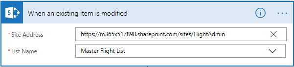

1. Choose the **...** on the **Send Email** box and choose **Delete**. Choose **OK** when prompted.

1. Choose **New Step**, then **Add an action**.
1. Enter `Contoso` in the search box, then select **Contoso Team Provisioning - NotifyFlightTeam**.
1. Fill in the fields as follows using the Flow UI.
    1. **sharePointItemId**: Under **Dynamic content** choose **See more**, then select **ID**.
    1. **newDepartureGate**: Under **Dynamic content** select **Departure Gate**.

    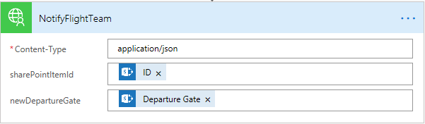

Select **Save** to save the flow.